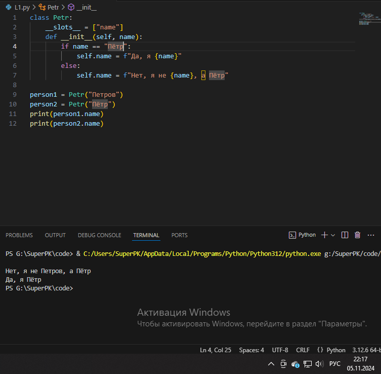
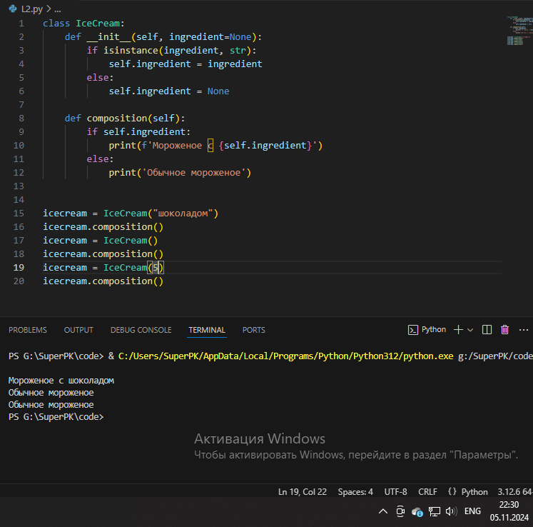
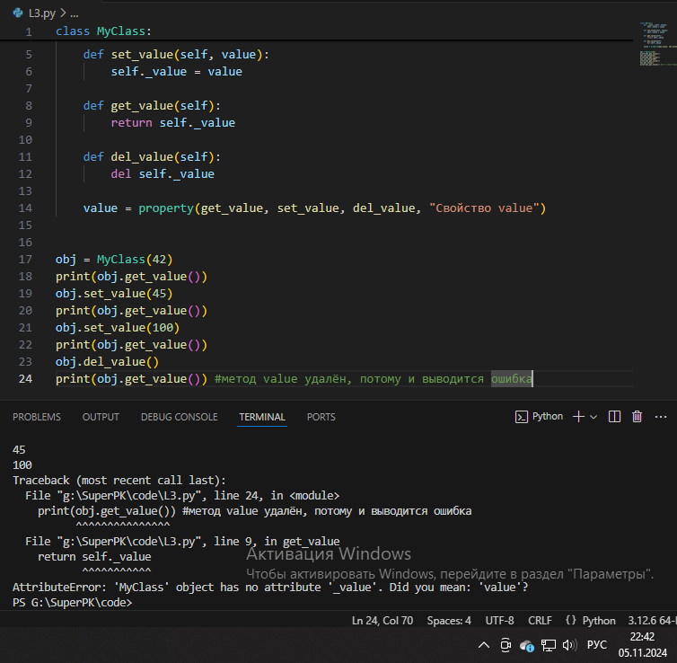
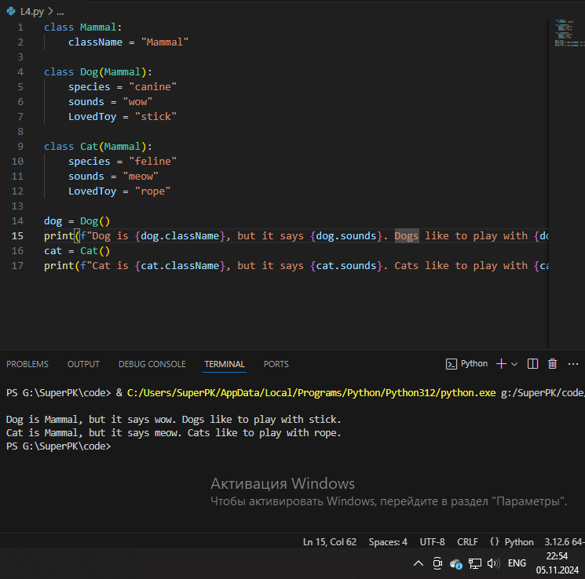
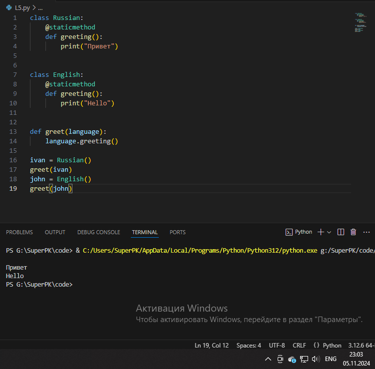

# Тема 8. Основы объектно-ориентированного программирования
Отчет по Теме #8 выполнил:
- Яцына Алексей Анатольевич
- ИВТ-22-2

| Задание | Лаб_раб | Сам_раб |
| ------ | ------ | ------ |
| Задание 1 | + | + |
| Задание 2 | + | + |
| Задание 3 | + | + |
| Задание 4 | + | + |
| Задание 5 | + | + |
| Задание 6 | - | - |
| Задание 7 | - | - |
| Задание 8 | - | - |
| Задание 9 | - | - |
| Задание 10 | - | - |

знак "+" - задание выполнено; знак "-" - задание не выполнено;

Работу проверили:
- к.э.н., доцент Панов М.А.

## Лабораторная работа №1
### Создайте класс “Car” с атрибутами производитель и модель. Создайте объект этого класса. Напишите комментарии для кода, объясняющие его работу. Результатом выполнения задания будет листинг кода с комментариями.

```python
# Определение класса
class Car:
    # Инициализация класса, через конструктор
    def __init__(self, make, model):
        # Установка базовых значений
        self.make = make
        self.model = model

# Создание экземпляра класса
my_car = Car("Toyota", "Corolla")
```

### Результат.


## Лабораторная работа №2
### Дополните код из первого задания, добавив в него атрибуты и методы класса, заставьте машину “поехать”. Напишите комментарии для кода, объясняющие его работу. Результатом выполнения задания будет листинг кода с комментариями и получившийся вывод в консоль.

```python
# Определение класса
class Car:
    # Инициализация класса, через конструктор
    def __init__(self, make, model):
        # Установка базовых значений
        self.make = make
        self.model = model

    # Определение метода drive
    def drive(self):
        print(f"Driving the {self.make} {self.model}")


# Создание экземпляра класса
my_car = Car("Toyota", "Corolla")
# Вызов метода drive
my_car.drive()
```

### Результат.


## Лабораторная работа №3
### Создайте новый класс “ElectricCar” с методом “charge” и атрибутом емкость батареи. Реализуйте его наследование от класса, созданного в первом задании. Заставьте машину поехать, а потом заряжаться. Напишите комментарии для кода, объясняющие его работу. Результатом выполнения задания будет листинг кода с комментариями и получившийся вывод в консоль

```python
# Определение класса
class Car:
    # Инициализация класса, через конструктор
    def __init__(self, make, model):
        # Установка базовых значений
        self.make = make
        self.model = model

    # Определение метода drive
    def drive(self):
        print(f"Driving the {self.make} {self.model}")

# Определяем класс. Указываем, что наследуес класс Car
class ElectricCar(Car):
    def __init__(self, make, model, battery_capacity):
        # вызываем конструктор наследуемового класса
        super().__init__(make, model)
        # Дополняем конструктор новым свойством
        self.battery_capacity = battery_capacity

    # Дополняем класс новым методом
    def charge(self):
        print(f"Charging the {self.make} {self.model} with {self.battery_capacity} kWh")

my_electric_car = ElectricCar("Tesla", "Model S", 75)
my_electric_car.drive()
my_electric_car.charge()
```

### Результат.


## Лабораторная работа №4
### Реализуйте инкапсуляцию для класса, созданного в первом задании. Создайте защищенный атрибут производителя и приватный атрибут модели. Вызовите защищенный атрибут и заставьте машину поехать. Напишите комментарии для кода, объясняющие его работу. Результатом выполнения задания будет листинг кода с комментариями и получившийся вывод в консоль.

```python
# Определение класса
class Car:
    # Инициализация класса, через конструктор
    def __init__(self, make, model):
        self._make = make # Защищённый атрибут
        self.__model = model # Приватный атрибут

    # Определение метода drive
    def drive(self):
        print(f"Driving the {self._make} {self.__model}")

my_car = Car("Toyota", "Corolla")
print(my_car._make) # Выводим защищённый атрибут
my_car.drive()
```

### Результат.


## Лабораторная работа №5
### Реализуйте полиморфизм создав основной (общий) класс “Shape”, а также еще два класса “Rectangle” и “Circle”. Внутри последних двух классов реализуйте методы для подсчета площади фигуры. После этого создайте массив с фигурами, поместите туда круг и прямоугольник, затем при помощи цикла выведите их площади. Напишите комментарии для кода, объясняющие его работу. Результатом выполнения задания будет листинг кода с комментариями и получившийся вывод в консоль

```python
# Шаблон, который обязует реализовывать метод area
# По сути это абстрактный класс, который служит лишь шаблоном
class Shape:
    def area(self):
        pass

# Определение класса квадрата
class Rectangle(Shape):
    def __init__(self, width, height):
        self.width = width
        self.height = height

    # Переопределения метода area
    def area(self):
        return self.width * self.height
    
# Определение класса круга
class Circle(Shape):
    def __init__(self, radius):
        self.radius = radius
    
    # Переопределения метода area
    def area(self):
        return 3.14 * self.radius * self.radius
    
rect = Rectangle(20, 40)
print(f"Площадь квадрата: {rect.area()}")

circle = Circle(5)
print(f"Площадь круга: {circle.area()}")
```

### Результат.


## Самостоятельная работа №1
### Самостоятельно создайте класс и его объект. Они должны отличаться, от тех, что указаны в теоретическом материале (методичке) и лабораторных заданиях. Результатом выполнения задания будет листинг кода и получившийся вывод консоли.

```python
class Player():
    # Инициализация полей
    def __init__(self, name, category):
        self.name = name
        self.category = category

    # Определяем метод, для вывода информации о игроке 
    def who_am_i(self):
        print(f"My name is {self.name} and i have a category {self.category}")

player1 = Player("Ivan", "Sniper")
player1.who_am_i()
```

### Результат.


## Самостоятельная работа №2
### Самостоятельно создайте атрибуты и методы для ранее созданного класса. Они должны отличаться, от тех, что указаны в теоретическом материале (методичке) и лабораторных заданиях. Результатом выполнения задания будет листинг кода и получившийся вывод консоли.

```python
class Animal():
    # Инициализация полей
    def __init__(self, name, species):
        self.name = name
        self.species = species

    # Метод для вывода информации о животном
    def who_am_i(self):
        print(f"Меня зовут {self.name}, и я {self.species}")

dog = Animal("Бадди", "Золотистый ретривер")
dog.who_am_i()
```

### Результат.


## Самостоятельная работа №3
### Самостоятельно реализуйте наследование, продолжая работать с ранее созданным классом. Оно должно отличаться, от того, что указано в теоретическом материале (методичке) и лабораторных заданиях. Результатом выполнения задания будет листинг кода и получившийся вывод консоли

```python
class Animal():
    # Инициализация полей
    def __init__(self, name, species):
        self.name = name
        self.species = species

    # Метод для вывода информации о животном
    def who_am_i(self):
        print(f"Меня зовут {self.name}, и я {self.species}")

class Dog(Animal):
    def __init__(self, name, breed, energy):
        # вызываем конструктор наследуемого класса
        super().__init__(name, "Собака")
        # Дополняем конструктор новыми свойствами
        self._breed = breed  # Защищённое свойство
        self._energy = energy  # Защищённое свойство

        self.__playtime = 0  # Приватное свойство

    def bark(self):
        print(f"{self.name} говорит: Гав!")

    def play(self, time):
        self.__playtime += time
        self._energy -= time * 5  # Энергия уменьшается с каждой игрой
        print(f"{self.name} играл(а) {time} минут. Общее время игры: {self.__playtime} минут.")

    def check_energy(self):
        print(f"Энергия {self.name}: {self._energy}")

# Создаем экземпляр класса Dog
dog = Dog("Бадди", "Золотистый ретривер", 100)

dog.who_am_i()

dog.check_energy()

dog.bark()

dog.play(10)
dog.play(15)

dog.check_energy()
```

### Результат.


## Самостоятельная работа №4
### Самостоятельно реализуйте инкапсуляцию, продолжая работать с ранее созданным классом. Она должна отличаться, от того, что указана в теоретическом материале (методичке) и лабораторных заданиях. Результатом выполнения задания будет листинг кода и получившийся вывод консоли.

```python
class Animal():
    # Инициализация полей
    def __init__(self, name, species):
        self.name = name
        self.species = species

    # Метод для вывода информации о животном
    def who_am_i(self):
        print(f"Меня зовут {self.name}, и я {self.species}")

class Dog(Animal):
    def __init__(self, name, breed, energy):
        # вызываем конструктор наследуемого класса
        super().__init__(name, "Собака")
        # Дополняем конструктор новыми свойствами
        self._breed = breed  # Защищённое свойство
        self._energy = energy  # Защищённое свойство

        self.__playtime = 0  # Приватное свойство

    def bark(self):
        print(f"{self.name} говорит: Гав!")

    def play(self, time):
        self.__playtime += time
        self._energy -= time * 5  # Энергия уменьшается с каждой игрой
        print(f"{self.name} играл(а) {time} минут. Общее время игры: {self.__playtime} минут.")

    def check_energy(self):
        print(f"Энергия {self.name}: {self._energy}")

# Создаем экземпляр класса Dog
dog = Dog("Бадди", "Золотистый ретривер", 100)

dog.who_am_i()

dog.check_energy()

dog.bark()

dog.play(10)
dog.play(15)

dog.check_energy()
```

### Результат.


## Самостоятельная работа №5
### Самостоятельно реализуйте полиморфизм. Он должен отличаться, от того, что указан в теоретическом материале (методичке) и лабораторных заданиях. Результатом выполнения задания будет листинг кода и получившийся вывод консоли.

```python
class BaseActions:
    def run(self):
        pass

    def stop(self):
        pass

class Animal(BaseActions):
    # Инициализация полей
    def __init__(self, name, species):
        self.name = name
        self.species = species

    # Метод для вывода информации о животном
    def who_am_i(self):
        print(f"Меня зовут {self.name}, и я {self.species}")

    # Переопределение методов
    def run(self):
        print(f"Животное {self.name} побежало")

    def stop(self):
        print(f"Животное {self.name} остановилось")

class Dog(Animal):
    def __init__(self, name, breed, energy):
        # вызываем конструктор наследуемого класса
        super().__init__(name, "Собака")
        # Дополняем конструктор новыми свойствами
        self._breed = breed  # Защищённое свойство
        self._energy = energy  # Защищённое свойство

        self.__playtime = 0  # Приватное свойство

    def bark(self):
        print(f"{self.name} говорит: Гав!")

    def play(self, time):
        self.__playtime += time
        self._energy -= time * 5  # Энергия уменьшается с каждой игрой
        print(f"{self.name} играл(а) {time} минут. Общее время игры: {self.__playtime} минут.")

    def check_energy(self):
        print(f"Энергия {self.name}: {self._energy}")

# Создаем экземпляр класса Dog
dog = Dog("Бадди", "Золотистый ретривер", 100)

dog.who_am_i()

dog.check_energy()

dog.run()
dog.stop()

dog.bark()

dog.play(10)
dog.play(15)

dog.check_energy()
```

### Результат.
